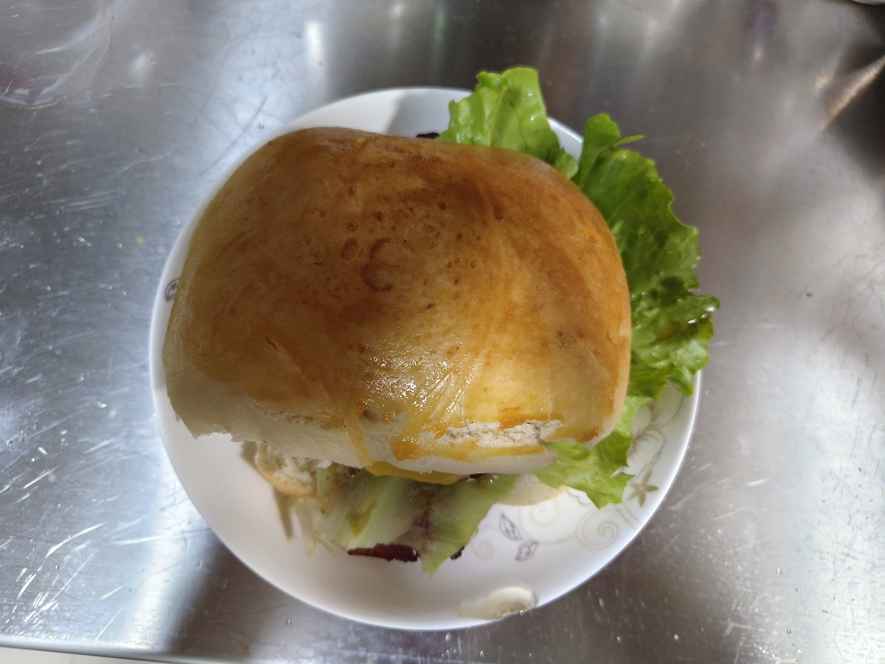
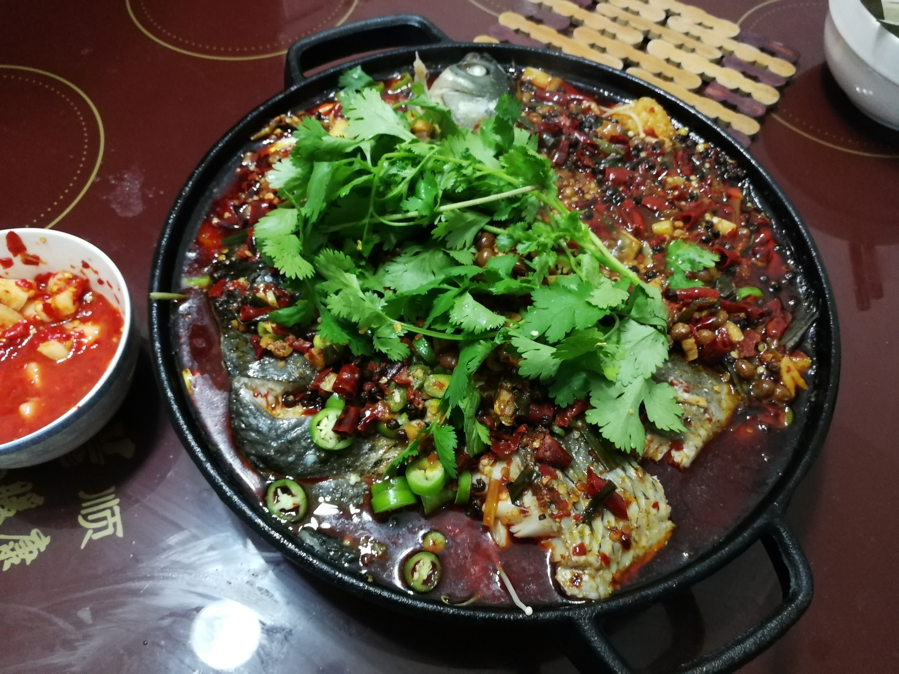
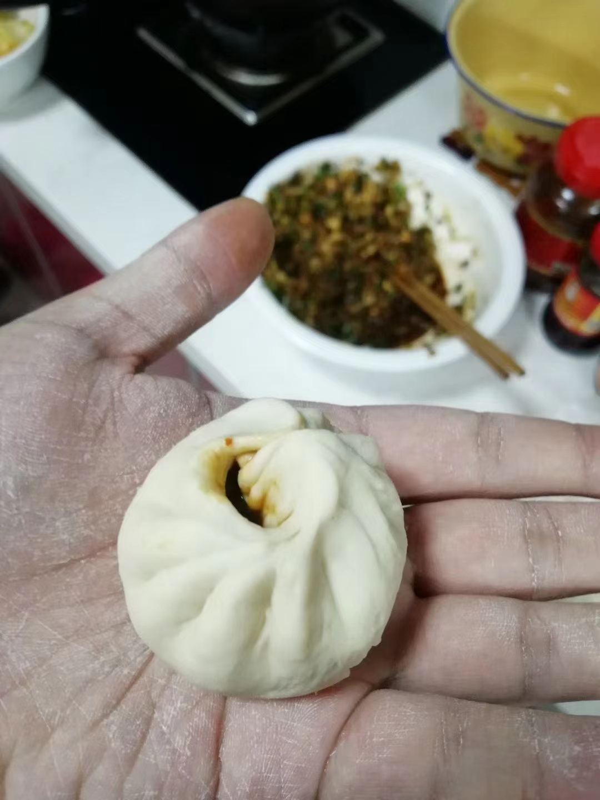
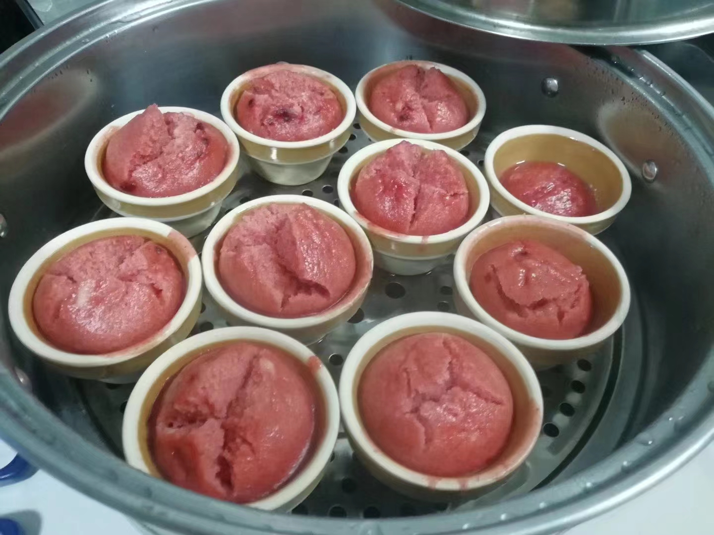
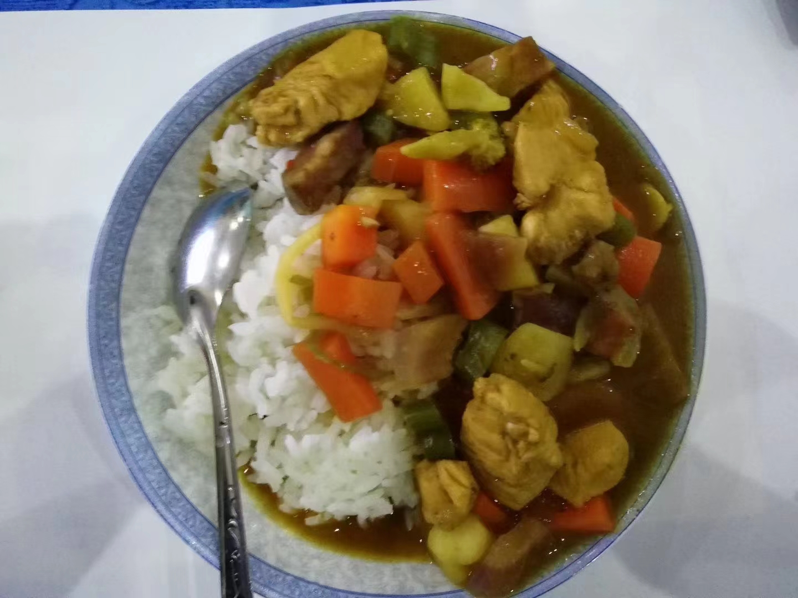

$\it Jun.2023 \enspace 馒头汉堡~$
---

$\it Jan.2021 \enspace 第一次做烤鱼$
---

$\it Mar.2020 \enspace 疫情在家和老妈闲来无事包包子$
---

$\it Jan.2019 \enspace 电视上看起来很好看就学着做了（客家笑粄）$
---

$\it Jan.2019 \enspace 看电视看馋了学做日式料理（蛋包饭+鸡肉咖喱饭）$
---

